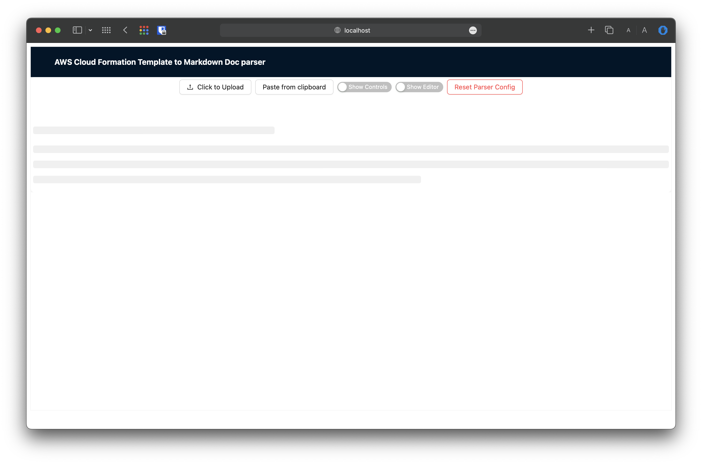
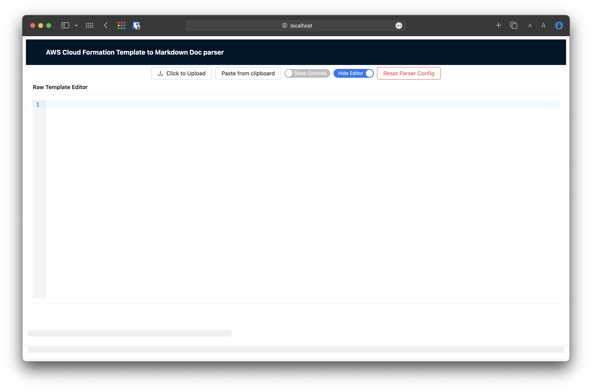
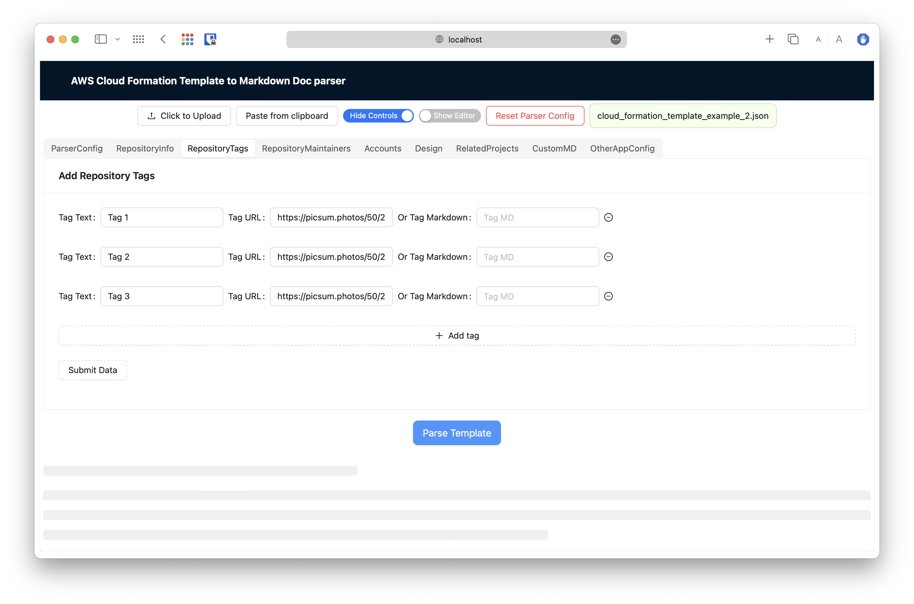
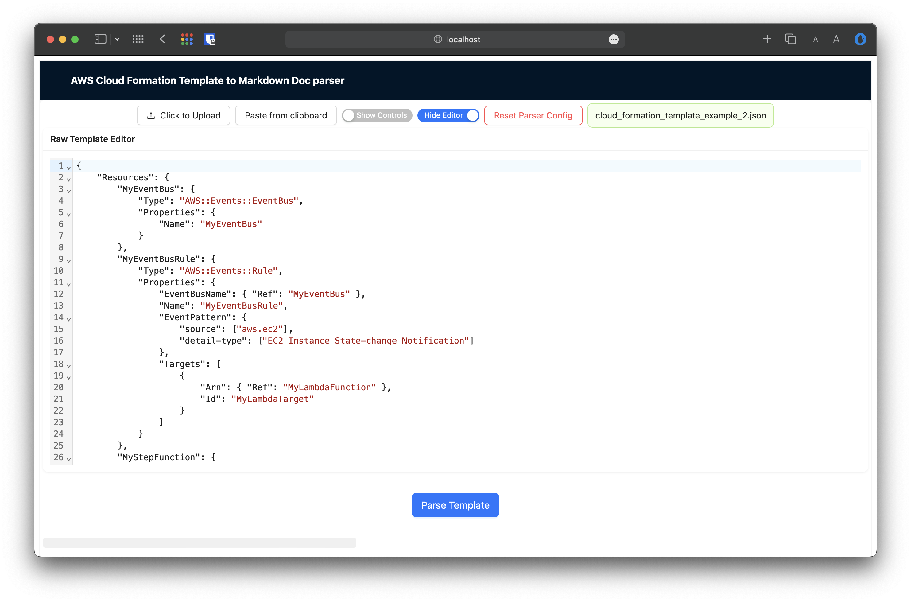

# aws-template-to-md
Converter of AWS CloudFormation template (Json) to readable MD document with only infrastructure elements

**It is just more POC to see if it will be really helpful for documentation creation**

## Purpose

During work with AWS Projects I had to create documentations for repositories that
contain [CDK](https://docs.aws.amazon.com/cdk/) projects.

The output of the CDK project is [CloudFormation Template](https://docs.aws.amazon.com/cloudformation/)

As result, documentation of the repository should contain information about created AWS resources, have links,
descriptions, etc, and the biggest part of it can be parsed from CloudFormation template.

## Screens

## Link to App

Link to the [Deployed App](https://sanyokkua.github.io/aws-template-to-md/)