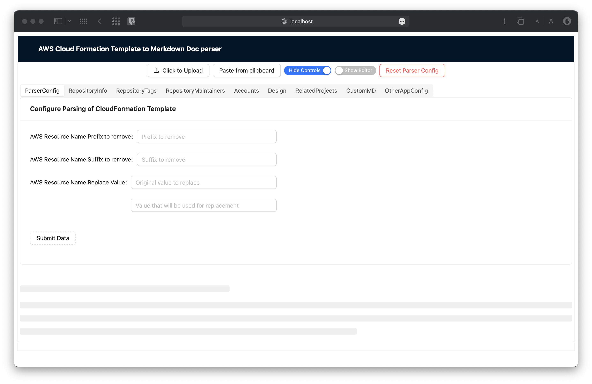

# aws-template-to-md

Converter of AWS CloudFormation template (JSON) to readable MD document with only infrastructure elements

**It is just more POC to see if it will be really helpful for documentation creation**

**THE MAIN IDEA - TO BE SECURE FOR PRODUCTION TEMPLATES AND COMPANIES, BECAUSE IT IS FULLY CLIENT SIDE APPLICATION,
WITHOUT PASSING ANY DATA TO THE SERVER**

## Purpose

During work with AWS Projects I had to create documentations for repositories that
contain [CDK](https://docs.aws.amazon.com/cdk/) projects.

The output of the CDK project is [CloudFormation Template](https://docs.aws.amazon.com/cloudformation/)

As result, documentation of the repository should contain information about created AWS resources, have links,
descriptions, etc, and the biggest part of it can be parsed from CloudFormation template.

## Supported AWS Resources

This application can find all AWS Resources in the template, but in the documentation will be displayed only several of
them.

- AWS::ApiGateway::RestApi
- AWS::DynamoDB::Table
- AWS::Events::EventBus
- AWS::Events::Rule
- AWS::Lambda::Function
- AWS::S3::Bucket
- AWS::SNS::Topic
- AWS::SQS::Queue
- AWS::StepFunctions::StateMachine

In the list above reflected only AWS Resources that usually are put into the Solution Component Diagram (at least in my
experience)

Based on these AWS Resources will be created documentation.
For each resource will be displayed crucial (subjective) information like name, endpoints, memory, table keys etc.

## Additional documentation sections

This app also helps to create additional documentation sections that also often used in the projects (again subjective).

- Repository Name (**Name of the Repository, header of the documentation**)
- Repository Tags (**Tags in the top of repository with build number, deployment versions, etc.**)
- Repository Description (**Some short description of the purpose of repository**)
- Table Of Content (**Table of Content - short links to documentation sections**)
- Repository Maintainers (**List of maintainers of repository with the contacts of each**)
- Repository Information (**Common information about technologies, branching strategy, links to other useful resources
  like CI-CD etc.**)
- Environments (**Information about environments where this app deployed**)
- Design (**Solution Design information and links to diagrams**)
- Related Projects (**Projects that are connected with this repository**)
- Amount of AWS Resources (**list of the all resources in template and their amount**)
- Main AWS Resources (**that mentioned before**)
- Customs (**Any other information, that can be added as RAW Markdown text**)

## Screens of the app

## Link to App

Link to the [Deployed App](https://sanyokkua.github.io/aws-template-to-md/)

## How to run it locally

1) Clone/Download repository
2) Run **npm install**
3) Run **npm run dev**

This will start local server and the app will be available on [http://localhost:3000](http://localhost:3000)

## How to build

To build the app do the same 2 steps from **How to run it locally**
And after that run **npm run build**, which will generate static app.

## Additional information

This app will not work with any CloudFormationTemplate, as it can have different formats, options, values that I didn't
face and as result didn't have included in the parsing mechanism.

You can try some example from this repository, or from your project and see if it works for you.

Also, probably not all information that is parsed will be useful or you will not find what is needed for you, so you can
clone this app and implement additional functionality.

I hope this project will serve as a good idea for automating building apps documentation.

## TODO List for app

- Write unit tests
- Add new AWS Resources
- Improve AWS Step Function Section parsing and markdown representation